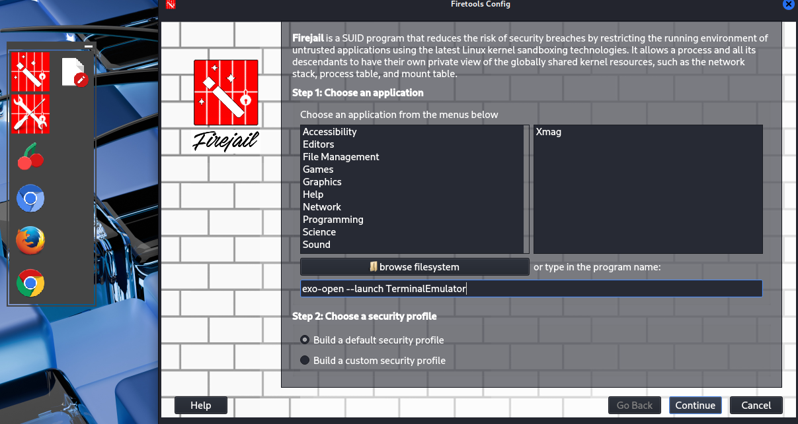
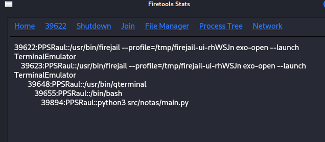
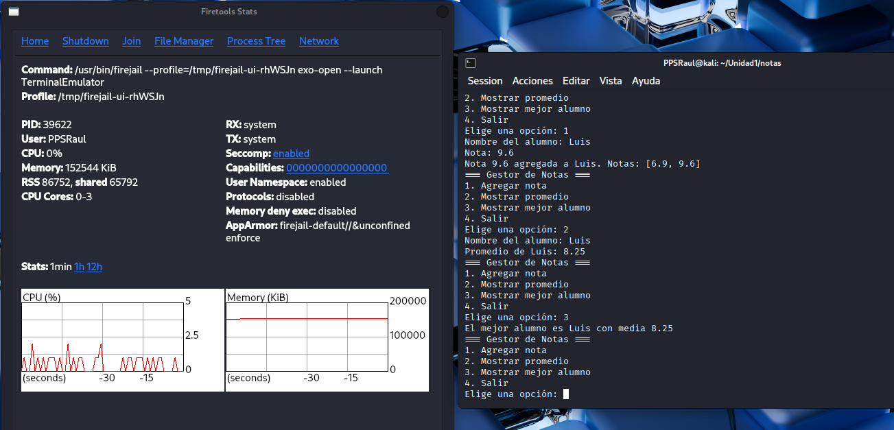

## Pruebas de aplicaciones utilizando un sandbox

En esta actividad hemos realizado unas pruebas de la aplicación notas, utilizando el sandbox firejail. Para ello hemos descargado Firejail y Firetools para obtener una mejor visión.
Ahora si ejecutar el programa con Firejail tenemos que tener en cuenta que los programas de Python necesitan ejecutarse desde un terminal que tenga instalado el entorno de Python, por tanto en firejail debemos ejecutar el comando para abrir un terminal dentro de nuestro entorno de pruebas
como se muestra en la siguiente imagen:

Una vez tenemos iniciado el terminal podemos ver sus procesos y el uso de recursos que está consumiendo, incluso ver desde dónde se ejecuta el programa que estamos probando:

Ahora para ejecutar el programa, debemos usar el comando python3 como hacemos normalmente en un terminal, ya que no dejamos de estar en uno aunque lo hayamos abierto con firejail.
Desde el terminal podemos ejecutar la aplicación y probarla viendo si funciona, además de los recursos que está ocupando:

Para terminar con las pruebas dentro de la caja de arena, hemos ejecutado el programa con los tests unitarios para ver el resultado que nos da:

Y como se puede observar un test nos dio un fallo.
